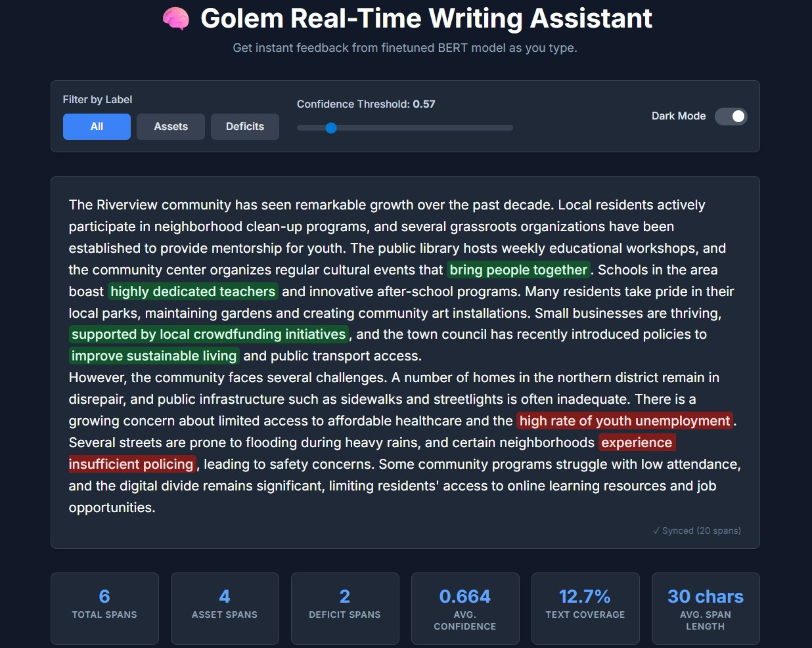

# Asset/Deficit Language Analysis using BERT

A web application that performs real-time semantic analysis on user provided documents to classify asset vs deficit based language. A custom BERT-base-uncased model was fine-tuned for this specific task. The model's development involved a pipeline that first scraped web content to build a corpus, then used a Llama 3 70B model to programmatically label text spans as asset or deficit-framed, and finally used this generated dataset to train BERT classifier. The final analysis is presented through an interactive Flask interface featuring color-coded text highlighting and confidence scores.

This project is a pipeline designed to analyze community development texts and identify **asset-based** versus **deficit-based** language patterns. The pipeline was built as part of research into language use in community development contexts, showcasing applied skills in **machine learning, natural language processing, and full-stack deployment**.

## Overview

* **Input**: URLs of community development articles/documents
* **Process**: Extract content → Label with LLMs → Fine-tune BERT model → Deploy with a web interface
* **Output**: An interactive web application for real-time classification of asset/deficit language



*The interactive web interface provides real-time asset/deficit language analysis as you type, highlighting patterns and providing confidence scores for immediate feedback.*

## Directory Structure

```
center/
├── crawler/                 # Stage 1: Web content extraction
│   ├── url_extractor.py
│   ├── data/input/          # URL CSV files
│   ├── data/output/         # Extracted content JSON
│   └── README.md
├── process_with_llm/        # Stage 2: LLM analysis & labeling  
│   ├── scripts/
│   │   ├── process_with_huggingface.py
│   │   └── process_with_ollama.py
│   ├── config/prompts.py
│   ├── data/output/         # Labeled datasets
│   └── README.md
├── bert_finetuning/         # Stage 3: BERT model training
│   ├── scripts/main.py
│   ├── config/
│   ├── models/              # Trained models
│   ├── data/                # Training datasets
│   └── README.md
├── bert_webapp/             # Stage 4: Web deployment
│   ├── web_service.py
│   ├── models/best_model/   # Final model
│   ├── templates/
│   └── README.md
└── README.md
```

## Pipeline Stages

### Stage 1: Web Content Extraction (`crawler/`)

Extract meaningful text content from a set of input URLs provided in CSV format.

```bash
cd crawler
python url_extractor.py --csv_file data/input/urls.csv --url_column URL
```

### Stage 2: LLM Analysis & Labeling (`process_with_llm/`)

Use large language models (HuggingFace or Ollama) to label text spans as **asset-based** or **deficit-based**.

```bash
cd process_with_llm
python scripts/process_with_huggingface.py --input ../crawler/data/output/results.json
```

### Stage 3: BERT Fine-Tuning (`bert_finetuning/`)

Train a BERT model for token-level classification based on the labeled dataset.

```bash
cd bert_finetuning
python scripts/main.py train --input ../process_with_llm/data/output/labeled_data.json
```

### Stage 4: Web Application (`bert_webapp/`)

Deploy the trained model into an interactive Flask-based web application.

```bash
cd bert_webapp
python model_loader.py --copy
./start_service.sh
```

Access at: `http://localhost:5000`

## Quick Start

```bash
# Clone repository
git clone <repository>
cd center

# Run full pipeline
cd crawler
python url_extractor.py --csv_file data/input/sample_urls.csv --url_column URL
cd ../process_with_llm
python scripts/process_with_huggingface.py --input ../crawler/data/output/results.json
cd ../bert_finetuning
python scripts/main.py train --input ../process_with_llm/data/output/labeled_results.json
cd ../bert_webapp
python model_loader.py --copy
./start_service.sh
```

## Detailed Workflow

```
URLs (CSV)
    ↓
Extracted Content (JSON)
    ↓
LLM-Labeled Dataset (JSON)
    ↓
Fine-tuned BERT Model
    ↓
Web Application
```

## Troubleshooting

### Common Issues

**1. CUDA Out of Memory**

```bash
python scripts/process_with_huggingface.py --batch-size 1
python scripts/main.py train --quantization 4bit
```

**2. Model Loading Issues**

```bash
rm -rf ~/.cache/huggingface/
python model_loader.py --copy --force
```
